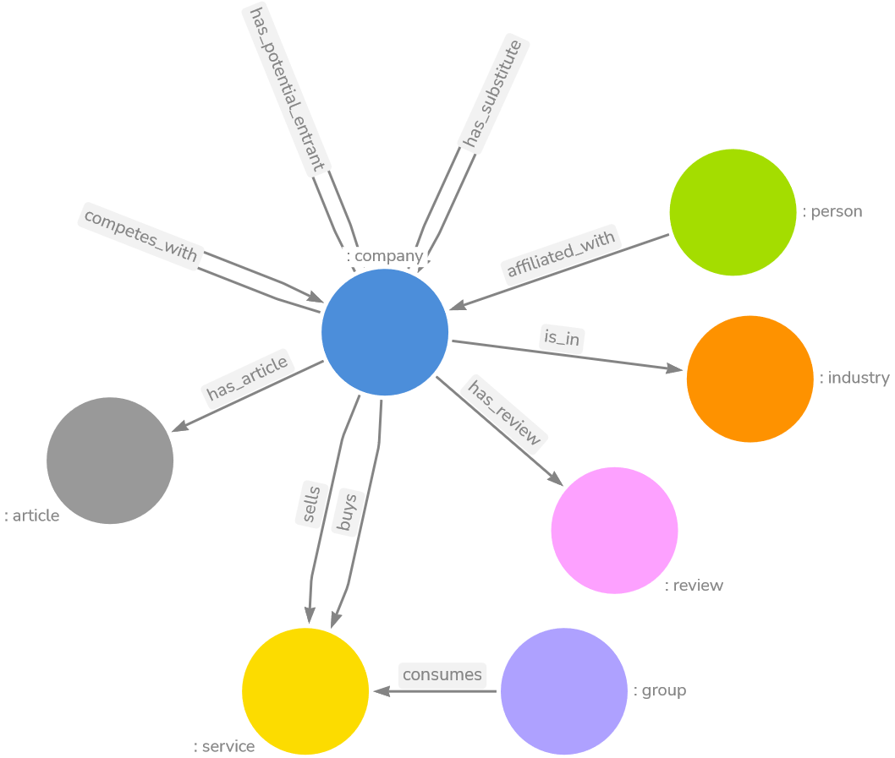
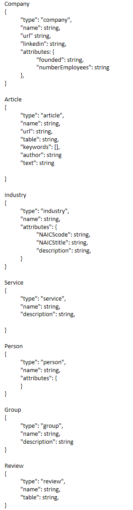

# Twitter Competitive Knowledge Graph

## MSDS-459 - Knowledge Engineering - Spring 2022

**don't forget to install requirements**  
pip install -r requirements.txt

**Sources I may or may not use:**  
https://towardsdatascience.com/auto-generated-knowledge-graphs-92ca99a81121  
https://hami-asmai.medium.com/relationship-extraction-from-any-web-articles-using-spacy-and-jupyter-notebook-in-6-steps-4444ee68763f  
https://www.analyticsvidhya.com/blog/2019/10/how-to-build-knowledge-graph-text-using-spacy/  
https://github.com/martin-majlis/Wikipedia-API/  
https://gist.github.com/aculich/b34868c098d94d614515  

**My Schema**  
  

**For eventual NLP not yet included in this repo:**  
Before you install spaCy:  
pip install -U pip setuptools wheel  
after you install spaCy:  
python -m spacy download en  

neuralcoref looks like it's not in active development right now, and I was unable to get the older versions of spaCy and neuralcoref do install correctly (wheel errors!)  
https://github.com/huggingface/neuralcoref

**Stuff to know**  
You have to make this your own. This is based on my company lists and my database schema. It's just a tool.  